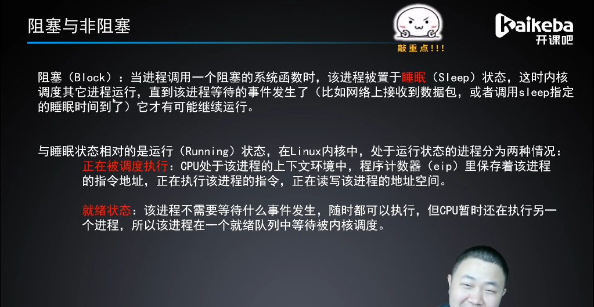

2021-8-9操作系统与网络编程

# 引子

## 操作系统

操作系统与用户程序：

- 一个比喻：网站服务器，作为后端工程师，需要处理大量的数据结构和数据，而前端工程师既不需要、也不应该意识到这些复杂数据结构的存在，只需要endpoint，一个特定的URl地址，取出前端需要的部分即可。这种通过抽象为用户提供易于理解的服务的想法，类似于操作系统和用户程序的关系。
- 操作系统为用户程序提供系统调用

并行：

- 将一个任务拆分为可以平行运行的多部分，在设备商同时运行
- 存在的一个问题：并行引起数组在多个线程中不一致的问题。

进程：

- 操作系统在用户进程和硬件之间添加了抽象层，用户进程间接使用各个硬件资源。
- 用户进程只能通过操作系统获得资源，如用户进程必须通过操作系统读写磁盘上的文件，而不能直接读取磁盘，进而保护了资源不被恶意进程滥用。
- 

抽象层：


操作系统的作用：

- 友好的用户接口和公共服务的提供者：向用户进程提供了读取、修改文件，与其他进程通讯的服务，而不要求用户进程理解系统对服务的实现方式和裸机的运行原理。
- 协调进程间交互：多个进程必须共享有限的物理资源，需要操作系统统筹规划，给每个进程分配适当的处理器时间、内存和其他资源等。
- 管理和控制资源：保证左右进程都可以正常运行，因此操作系统必须将有限的物理资源（处理器时间、内存、I/O设备时间）合理的分配给不同的进程，提高资源利用率，缩短交互进程响应时间，防止进程利用其它进程的资源或恶意干扰其运行。

操作系统内核（kernel）：除了浏览器、文本编辑器等功能，执行操作系统的核心功能（上述三大作用）的部分称为操作系统内核。

1、操作系统与用户进程的分隔：

- 处理器时间
  - 一部分时间里，内核在处理器上运行，分配资源给用户进程，决定下一个运行的进程；
  - 另一部分时间里，用户进程在运行。
- 存储空间
  - 系统空间（kernel space）：内核所用的存储空间为系统空间。
  - 用户空间（user space）：

2、操作系统与用户进程的联系：

是计算机从用户态进入内核态的一种方法。

- 系统调用：操作系统提供了一套给用户进程的服务，即系统调用，使用户进程可以在固定的位置进入系统空间，使用系统提供的服务。所有系统调用程序地址被存放在存储器的某一位置，被称为系统调用表。
- 中断（外中断）：来自处理器之外的中断信号
- 异常（内中断）（exception）：是在进程运行过程中来自处理器内部的中断信号


## C语言复习

字符串操作

- 语法

  ```
  //字符串常用操作函数：
  string.h头文件：
  char* strcpy(char* dest, char* src);
  //在复制字符串时，dest自动在末尾加上\0，因此dest的长度必须必src多至少1个字符。
  size_t strlen(const char* str);
  int strcmp(char* str1, char* str2);
  char* strcat(char* dest, char* src);
  char* strtok(char* str, const char* delimiters);
  ```
  

内存操作

- 语法

  ```
  //一段内存值的设定
  string.h头文件：
  
  void * memset(void *ptr, int val, size_t num)//将从ptr所指向的内存开始、大小为num字节的内存空间的值设为val（常用来设0）
  
  void *memcpy(void *destination, const void *source, size_t num)//将由source指针所指向的位置开始、大小为num字节的内存，复制到以destination指针开始、长度为num字节的内存中
  
  ```

## 进程

### 进程的由来：

- 用户一侧的抽象：

  由于计算机所拥有的的物理资源有限，当多个程序在计算机上同时运行时，它们不可能连续的在处理器上运行或占用全部内存，因此需要进程的抽象在用户的一侧隐藏上下文切换等细节。

  用户一侧的抽象：用户所使用的抽象内存->映射为实际内存和外存。

  **进程作为运行的程序的抽象，包含了一个程序的运行状态和这个程序所用的抽象内存及其中存储的数据。**

  地址空间（address space）：一个进程可以使用的全部内存的地址和它们存储的数据。

  可以将进程笼统的看做一个或多个线程与一个地址空间的结合。

- 系统侧的实现：

  达到的目的或要求

  - 进程的结构必须囊括一个进程的运行状态，在中断、异常或系统调度进入内核态时，应将进程运行状态放入内存中某一位置，使得在另一个时间点根据进程优先级接着这次的进度再次运行该进程；
  - 在系统一侧包含从用户抽象内存向实际内存和外存的映射，以便通过抽象内存的地址获得物理地址和其中存储的数据。抽象内存 ->（找到） 实际物理地址和其中存储的数据。

- 并发（concurrency）：多个进程在处理器上运行

- 并行（parallelism）：在物理时间上、进程在多个处理器或多个核上同时运行。

- 线程（thread）：一个进程在多个核或多个处理器上并行时，在不同的处理器上的运行状态不同，此即为线程。

  - 线程控制块（thread control bolck，TCB）：用来存储某一个线程上的处理器状态寄存器、指令计数器、栈指针、通用寄存器等运行状态数值。但多个线程共享一个地址空间。

- 进程总结：

  - 定义：运行程序的抽象，主要包含两方面信息：一是该程序运行状态；二是所用抽象内存及其中存储的数据。

  - 地址空间：一个进程可以使用的全部内存的地址和它们存储的数据。（最底层）

  - 地址转换：用户抽象内存向物理内存的映射。（底层向用户抽象内存的映射）

    - base and bound方法，base代表基地址（系统分配给一个进程的可用内存的起始地址），bound代表这个进程可用的内存的最高地址。

    - 映射关系：基地址+抽象内存地址=实际地址，当实际地址<=bound，内核就允许进程进行该操作。

  - 一个进程，包含多个线程，每个线程控制块记录各自线程的运行状态数值，多个线程共享同一个地址空间。

  - 进程控制块（process control bolck，PCB）：一个数据结构，包含：

    - 地址转换信息
    - 线程运行状态信息
    - 系统在调度进程时需要的信息：进程号、进程所处状态、进程优先级等。由于包含了此类信息，因此用户进程无权限修改进程控制块，进程控制块存储在内核空间中。

### 进程状态

三态模型：

- 运行态（running）：
- 就绪态（ready）：进程不能从就绪态直接进入等待态。因为进入等待态是因为运行所需要的某个条件没有满足，而对于就绪队列中的进程，我们无法预知未来当其进入运行态的时候这些条件是否满足，因此不需要使其进入等待态。
- 等待态（wait）：进程在等待某一事件完成然后才能排入就绪态，然后才可能被选为下一个运行进程。

五态模型：

- 新建态（new）：进程被创建时尚未加入就绪队列的状态。为了新建一个进程，内核需要给进程分配资源（建立进程控制块）、建立必要的管理信息，在此过程中即为新建态。

  如果一个新进程在未获得全部资源以前就进入就绪队列，可能产生错误。

- 终止态（exit）：进程已经结束，但尚未被系统撤销，系统仍然可以获得该进程结束时的信息。

  如果一个进程A创建了另一个进程B，且想要等待B运行完毕并从中获得一些信息，那么终止态的缺失将导致B率先运行完毕被撤销，而A无法从B处获得任何信息。此时B进程就称为“僵尸进程"，停留在系统内存中，会导致系统变慢。

### 进程的几个函数

- fork（）：


```
语法:
#include <unistd.h>
pid_t fork(void)
fork（）执行完毕后返回一个进程标识IP（pid）：在父进程中返回的pid是其新建的子进程的进程标识ID；在子进程中返回的进程标识ID为0。区分父、子进程。
```

- exit（）：

```
语法：
#include <stdlib.h>
void exit(int status)
一个进程运行结束或产生重大错误后会被系统终止，也可以系统调用exit主动结束这个程序。
status表示这个进程退出时的结束状态，status会作为子进程的结束状态被提供给wait（）的第一个参数。
exit（）函数的实质：the value of statur & 0377 is returned to the parent。即status与0377的位与运算的结果将返回给父进程。0377是八进制，表示的数是011 111 111，即status为0-255范围内的数，与255位与运算，返回status的值。
```

- wait（）：


```
语法：
#include <sys/wait.h>
pid_t wait(int *stat_loc)
wait函数会使父进程的状态变为等待态，知道父进程所有子进程中的一个成功退出并返回结束状态值，父进程才进入就绪态，准备继续运行。
父进程不能直接灯带子进程的子进程！
```

- waitpid（）：


```
语法：
pid_t waitpid(pid_t pid, int *stat_loc, int options)
相比wait函数，可在pid参数里指定一个进程标识ID，以此来等待一个有特定的进程标识ID的进程
（1）pid > 0：等待pid为该数的子进程；
（2）pid == -1：等待所有子进程中的任何一个；（pid == -1 && options == 0时与wait一样）
（3）pid == 0：等待所有进程组标识ID与父进程相同的子进程；
（4）pid < -1：任何进程组标识ID为pid的绝对值的进程。
```

- exec（）：


？？？？？？


## 内存管理

内存管理的目的是保证多个进程运行互不影响、互不能修改，每个进程均有其自己的地址空间。

操作系统需要将进程的逻辑地址转化为物理内存中的实际地址。


碎片（fragmentation）：

- 外部碎片（external）：指因长度过短而无法被使用的未分配内存。
- 内部碎片（internal）：指的是已分配内存中因为分配长度过长而没有被进程有效利用的内存。

碎片的作用：评价一个用来实现地址转换和内存分配的方法的优劣。


连续内存管理方法历史发展：

- 固定分区存储管理（fixed partition）：内存空间分为数目固定的分区，每个分区大小都与其它分区不同。
- 可变分区存储管理（variable partition）：按照不同进程所需的内存大小划分分区，并将所有未分配分区存放在一个链表中。


# 直播

## 8.16-文件与IO-P1

- 操作系统

  - 内核：

  - 壳，shell：

- 系统编程是什么？

  使用系统调用进行编程

  - 内核：系统内核直接封装好的函数，向外提供各种服务。
  - 系统调用：而想使用这些服务，就需要使用系统调用，system call。

  - 内核管理核心资源：文件、进程、线程。

  - 接口：系统调用时能保证安全可靠的操作这些核心资源。

  

- 系统编程+网络编程概述

  进程：运行中的程序。怎么运行：读出来，加载到内存中，才可以运行。


- 怎么学


- 内容

  - 文件IO

  - 多进程编程

  - 进程间通信

  - 多线程编程

  - 计算机网络

    - 服务器端口：提供多个服务时，不同的服务就是通过不同的端口。ssh，22端口；web，80端口；mysql，3306端口，等。
    - 域名：IP地址->域名，个人计算机发送域名到DNS进行域名解析，转化为IP地址发回给个人计算机，个人计算机再通过IP地址访问服务器。


## 8.18-

- write写文件
  - 
  - 


数字+K：某个命令上按此命令，返回该命令man手册内容

- vim下分屏相关操作：
  - :sp：横向分屏
  - :vsplit：竖向分屏
  - ctrl+w：切换窗口
  - :q：退出当前窗口

- 编译过程命令：

  gcc hello.c -[ESc] -o hello.[iso]

  - （1）gcc hello.c -E -o hello.i：preprocess，做宏替换等预处理
  - （2）gcc hello.c -S -o hello.s：compile（编译），编译为汇编语言
  - （3）gcc hello.c -c -o hello.o：assemble，汇编，输出为机器码
  - （4）gcc hello.o -o hello：link，链接器，输出为可执行文件

- 项目思路：自顶向下，逐步分解；自下向上，逐步积累。流程图的重要性


# 深入理解计算机系统

## 1、综述

## 2、信息表示：0和1的运算

### 信息表示方法

基本思路：0和1，位，字节，跨字节，寻址和多字节顺序

- 二值法，单个的位

- 位的组合：单个的位没有意义，多个位的组合再加上某种解释，即可表示信息。

- 三种进制：

  - 十进制（Decimal，缩写DEC）：人类习惯
  - 二进制（Binary，缩写BIN）：表示信息最方便的方法。但8位位数太多，对于描述位模式不方便。
  - 十六进制（Hexadecimal，缩写HEX）：可用2个位实现二进制8位所能表示的，可用十六进制的2个位表示一字节的内容。
  - 八进制（Octonary，缩写OCT）：

- 字：机器字长，word size，字长决定的最重要的系统参数就是虚拟地址空间的最大大小。比如，32位计算机，虚拟地址的范围是0-（2^32-1），程序最多访问2^32字节；对于64位计算机，同理。

- 数据大小：在机器上，规定了不同的字节长度来编码数字，比如32位系统下short int为2字节，int为4字节，char为1字节；64位系统下int为4字节，long long为8字节，char为1字节等。

- 寻址和字节顺序：

  对于跨越多个字节的程序对象，必须建立两个规则：一是这个对象的地址是什么；二是在存储器中如果对这些字节排序。

  - 寻址：多字节对象都被存储为连续的字节序列，对象的地址为所使用的字节序列中最小的地址。

  - 字节顺序：（由不同的机器决定，对人而言不可见）

    - 小端法（little endian）：按照从最低有效字节到最高有效字节的顺序存储对象；
    - 大端法（big endian）：按照从最高有效字节到最低有效字节的顺序存储对象。

    网络主机间通讯时，必须转换为网络字节顺序。


# 网络编程

### socket

#### C/S架构的socket连接过程

- 服务端：服务器使用的端口是知名端口，明确的，比如http使用80端口，ssh使用22端口。
  - 在服务端建立一个socket后应该调用bind（）将这个socket与一个端口连接起来（与明确应用功能的知名端口bind）
  - 之后调用listen（）在这个端口等待连接
  - 调用accept（）等到新的连接到来时，将新建一个socket进行通信，并用原来的socket继续等待下一个连接请求。accept（）默认模式是阻塞的，因此可以在一个循环里不断调用这个函数，等待新的连接。
- 客户端：客户端建议一个socket后，只需要将这个socket对应的文件描述符和包含了服务器IP地址和端口struct sock_addr_in结构体作为参数，调用connect（），就可以将这个socket与指定的主机连接。


# 系统编程

贯穿始终的一些基本问题：

- Q1：hello world为何能输出到屏幕上？

  C语言函数->

- Q2：操作系统是干什么的，他的主要任务是什么？

  操作系统管理硬件资源的。


## （一）概述

- 系统编程定义：利用操作系统的系统调用接口（函数），操作内存、磁盘、I/O设备（含网络）等进行编程。系统调用时关键。


- 特点
  - 无法跨平台：主要使用Linux系统。特点是开源、轻量。
  - 速度慢：用户空间到内核空间的切换需要时间。
  - 更加底层、接口更复杂：引入的头文件更多，函数传入的参数更多。

## （二）文件I/O

### 1、文件I/O标准库函数与系统调用（函数）的关系

本节旨在分析C语言标准库的I/O函数与系统调用I/O函数（内核的I/O函数）之间的关系、协同作用、差异、不同应用需求。

#### （1）文件I/O函数

- C语言标准库I/O函数：fopen，fgetc，fputc，fclose

- 系统调用I/O函数：open，read，write，close


#### （2）C标准库函数打开文件、读取数据、写入数据、关闭文件的流程与系统调用

句柄思想：

- fopen（3）与open（2）：C标准库fopen函数打开文件过程，fopen（path，mode），传入文件路径和模式两个参数。
  - 调用open（2）打开指定文件，open返回一个文件描述符（int类型的编号），分配一个FILE结构体，包含改文件的描述符、I/O缓冲区和当前读写位置信息，返回这个FILE结构体的地址。
  - FILE *fp = fopen（path，mode），有fp指针记录系统调用open返回的文件结构体地址。

.png)


- fgetc（3）与read（2）：从文件中读取字符。fgetc（FILE *stream），传入fp指针即可。
  - 通过传入的FILE *参数找到该文件的描述符、I/O缓冲区和当前读写位置，判断能否从I/O缓冲区中读到下一个字符。如果能读到就直接返回该字符，否则调用read（2），把文件描述符传进去，让内核读取该文件的数据到I/O缓冲区，然后返回下一个字符。
  - fgetc只操作到缓冲区。

.PNG)


- fputc（3）与write（2）：将字符写入文件。fputc（char c，FILE *stream)，传入待写入字符串和fp指针。
  - 使用fputc将字符写入文件时，首先判断该文件的I/O缓冲区是否有空间再存放一个字符，如果有空间则直接将该字符保存在I/O缓冲区并返回，如果I/O缓冲区已满就调用write（2），让内核把I/O缓冲区的内容写回文件。


- fclose（3）：fclose（FILE *stream），传入待关闭文件的fp指针。
  - 关闭文件时，如果该文件的I/O缓冲区中还有数据没写回文件，就调用write（2）写回文件；
  - 然后调用close（2）关闭文件，释放FILE结构体和I/O缓冲区。
  - 缓冲区的概念及分类：
    - 全缓冲：当缓冲区满时，系统调用write（2）写入。
    - 行缓冲：当遇到换行符时，系统调用执行write（2）。
    - 无缓冲：直接对单个字符进行直接系统调用，执行读取和写入操作。stderr是无缓冲。

.PNG)

#### （3）问题：

open、read、write和close等系统函数成为无缓冲I/O（unbuffered I/O）函数，因为他们位于C标准库的I/O缓冲区的底层。

- 用户程序在读写文件时既可以调用C标准I/O库函数，也可以直接调用底层的Unbuffered I/O函数，那么用哪一组函数好呢？

  - 需要实时操作的内容最好直接使用系统调用，比如网络编程、游戏等。

  - 其余用C标准库函数即可。

### 2、系统调用-open、close、read、write函数

#### （1）open

- 语法：

  ```c
  #include <sys/types.h>
  #include <sys/stat.h>
  #Include <fcntl.h>
  int open(const char *pathname, int flags, mode_t mode)
  ```

  - 返回值：返回int型文件描述符fd，多个fd时，open返回的文件描述符一定是该进程尚未使用的最小描述符。若出错，返回-1并设置errno。0,1,2被sdtin，stdout和stderr占用，所以别的文件描述符从3开始。
  - pathname：文件路径，可通过int main(int argc, char *argv[])传入文件名
  - flags：O_RDONLY，O_WRONLY，O_CREAT等
  - mode：可选，比如当创建O_CREAT时，如果文件不存在，可选创建，此时需要用mode指定所创建文件权限。

- umask：面具。设定mode参数时，权限设置0777时，返回的文件实际并没有777的权限，用umask可查看没有哪个权限，并可修改权限。
- 必选参数：
- 可选参数：
  - O_EXCL：第一，与O_CREAT联合使用；第二如果带创建文件不存在，则执行与O_CREAT一样的过程。如果已存在，则返回error。
  - 


#### （2）close

- close函数：

  - 含义：int close(int fd)，传入要关闭的文件描述符。

  - 返回值：成功关闭返回0，出错返回-1并设置errno。

#### （3）read

- 语法：

  - 含义：从fd指向的文件中读取count个字节的字符，存入buf缓冲区。
  
  - 返回值：成功时，返回所读的字节数。0字节代表读到文件尾部了。如果返回的值比count小，不代表错误，仅代表实际读到的字节数比count小。错误时，返回-1，并且返回errno。
  
  ```c
  ssize_t read(int fd, char *buf, int count)
  //（1）从文件中读数据，fd为open打开的文件描述符。
  //（2）从标准输入读数据，fd为STDIN_FILENO，即标准输入（可引出非阻塞读文件）。
  //当通过SDTIN输入时，若输入的字符长度超过count，则多出的部分会由shell监听接收并执行。
  ```


#### （4）write

- 语法：

  - 含义：从buf缓冲区中，将count字节的字符，写入到fd指向的文件中。
  - 返回值：成功时，返回所读的字节数。0字节代表未写入任何东西。如果返回的值比count小，不代表错误，仅代表实际写入的字节数比count小。错误时，返回-1，并且设置errno。
  
  ```c
  ssize_t write(int fd, char *buf, int count)
  //（1）从buf中将数据写入fd文件中
  //（2）从buf中将数据写入标准输出中SDTIN_FILENO。
  ```


#### （5）阻塞与非阻塞

- 语法

  ```c
  int fd = open("/dev/tty", O_RDONLY | O_NONBLOCK);
  ```

  




#### （6）lseek

- 语法：作用与fseek相同，只不过针对的是系统调用的IO，而fseek针对的是标准IO。

  - 返回值：成功时，返回偏移结果所指向的数据位置（从开始处算起）。错误时，返回-1，并设置errno。

  ```c
  #include <sys/types.h>
  #include <unistd.h>
  off_t lseek(int fd, off_t offset, int whence);
  ```


#### （7）fcntl

- 含义：可以用fcntl获得一个已打开文件的属性。

- 语法

  ```c
  #include <unistd.h>
  #include <fcntl.h>
  int fcntl(int fd, int cmd);
  int fcntl(int fd, int cmd, long arg);
  int fcntl(int fd, int cmd, struct flock *lock);
  ```

- 几种用法：

  - 将一个已打开文件的属性改变而不必重新open文件（通过open的方式，改变O_RDONLY，O_NONBLOCK等），可以重新设置读、写、追加、非阻塞等标志。

    F_GETFL得到文件描述符flags值，可通过与某一属性或的运算，增加某一属性；

    F_SETFL将修改后的flags写入文件属性；

  - 设置文件锁。设置当前进程如何访问设备或文件的访问控制属性。

- 返回值：

  - 成功时：

    F_GETFD：返回文件描述符flags值

    F_GETFL：返回file status flags（文件权限状态值）

  - 错误时：返回-1，并设置errno。

#### （8）ioctl

control device

- 语法：

  ```c
  #include <sys/ioctl.h>
  int ioctl(int fd, unsigned long request, ...);
  ```

#### （9）mmap

内存映射，将文件或设备映射到内存中。

- 语法

  ```c
  #include <sys/mman.h>
  void *mmap(void *addr, size_t length, int prot, int flags, int fd, off_t offset);
  ```

  - addr：指定映射到内存中开始的地址，通常置为NULL；
  - length：文件中需要映射的字节长度；
  - prot：PROT_WRITE，PROT_READ，PROT_EXEC， PROT_NONE
  - flags：MAP_SHARED，MAP_PRIVATE
  - fd：文件描述符
  - offset：length个字节的数据起始偏移位置。为0时表示从头开始。

### 3、标准IO-fopen、fclose、fgetc、fputc

#### （1）fopen

- 语法

  ```c
  FILE *fopen（const char *path, mode）;
  ```

  


#### （2）fclose

- 语法

  ```c
  int fclose(FILE *fp);
  ```


#### （3）fgetc

- 语法

  ```c
  //fgetc() reads next character from stream and returns it as an unsigned char cast to an int, or EOF on end of file or error.
  //从数据流中读取下一个字符串，并返回一个无符号字符（转化为整型，或者读至文件末尾时为EOF，或者error）
  char fgetc(FILE *fp);
  int fgetc(FILE *fp);
  ```


#### （4）fputc

- 语法

  ```c
  int fputc();
  ```


#### （5）练习：

- 实现cat命令
- 实现cp命令
- 实现文件大小查询命令

#### （6）fseek、ftell、rewind

数据流中指向数据的指针的重定位。

- fseek：语法。正确时，返回值为0；错误时，返回-1，并且errno返回错误内容。

  ```c
  int fseek(FILE *stream, long offset, int whence);
  ```

  

- ftell：获得当前数据流指针所指向的位置。返回当前指向的位置。

  ```c
  int ftell(FILE *stream);
  ```

  

- rewind：语法，无返回值。

  ```c
  void rewind(FILE *stream);
  //等同于void fseek(FILE *stream, 0, SEEK_SET);
  ```

### 4、文件系统

#### （1）ext2文件系统

- inode table

- datablock

#### （2）stat

#### （3）VFS虚拟文件系统

#### （4）dup和dup2用法

### 5、目录文件（dir文件）

目录文件（目录中的 . ）中存储的是其内的各个文件的名称。本节函数即打开目录文件、读取文件名称等信息。

#### （1）opendir（3）

打开目录

- 语法

  ```c
  #include <sys/types.h>
  #include <dirent.h>
  
  DIR *opendir(const char *name);
  DIR *fdopendir(int fd);
  ```

  

- 返回值：返回指向目录流的指针。


#### （2）readdir（3）

- 语法

  ```c
  #include <dirent.h>
  struct dirent *readdir(DIR *dirp);
  
  struct dirent{
  	ino_t d_ino;//Inode number
      off_t d_off;//Not an offset
      unsigned short d_reclen;//length of this record
      unsigned char d_type;//Type of file
      char d_name[256];//NULL-terminated filename
  };
  ```

- 返回值：返回一个指向下一个目录文件名称的dirent结构体指针。到达目录流末尾时，返回NULL。发生错误时返回NULL。

#### （3）closedir（3）


#### （4）递归打印目录中的文件名

stat()判断该文件是否是目录，若是目录，则递归打印该目录内容。

### 6、练习

- mycat：打印文件内容
- mycp：复制文件
- myls -al：打印目录及详细信息，循环打印目录


## （三）进程

### 1、进程概述与PCB块


### 2、fork（）

- 语法

  

getpid（）、getppid（）


### 3、exec族函数

- execlp（）

  ```c
  execlp()
  /*第一个参数看是否带斜杠，带斜杠是路径，不带斜杠程序自动从环境变量中寻找；
  const char *argv该多参数中，第一个参数不解析，可随便传（程序从第二个开始解析）
  
  */
  ```

  


### 4、wait，waitpid（进程间同步）

同步和异步：同步就是等待第一个操作完成，再完成第二个操作。异步是第一个操作未完成，可执行第二个操作。

#### （1）wait（）


#### waitpid（）


#### 孤儿进程和僵尸进程

- 孤儿进程：


- 僵尸进程：
  - 定义
  - 特点：僵尸进程无法通过kill -9 pid命令杀死，只能通过结束父进程后，由1号进程回收；


#### 进程内存控制及进程竞争


### 5、进程间通信

#### （1）定义：IPC，InterProcess Communication。


IPC工具分为两大类：数据传输工具和共享内存。

- 数据传输工具：
  - 过程：此类工具与别的IPC工具的区别在于：写入和读取的概念。为了通信，一个进程将数据写入到IPC工具中，另一个进程从中读取数据。要求在用户内存和内核内存之间进行两次数据传输，一次传输是在写入的时候从用户内存到内核内存，另一次传输是在读取的时候从内核内存到用户内存。
  - 分类：
    - 字节流：管道、FIFO、数据包socket：交换的数据是一个无分隔符的字节流，每个读取操作可能会从IPC工具中读取任意数量的字节，这个模型参考了unix中“文件是一个字节序列”模型。
    - 消息：System V消息队列、POSIX消息队列以及数据包socket：交换的数据是以分隔符分隔的消息。每个读取操作读取由写者写入的一整条消息，无法只读取部分消息，而把剩余部分留在IPC工具中，也无法在一个读取操作中读取多条消息。
    - 伪终端：
  - 特点（与共享内存之间的差别）
    - 读取操作是具有破坏性的。读取操作会消耗数据，其他进程将无法获取所消耗的数据。
    - 读取者和写者进程之间的同步是原子的。如果一个读取者试图从一个当前不包含数据的数据传输工具中读取数据，那么在默认情况下读取操作会被阻塞直至一些进程向该工具写入了数据。
- 共享内存：
  - 过程：允许进程通过将数据放到由进程间共享的一块内存中以完成信息的交换。一个进程可以通过将数据放到共享内存块中使得其他进程读取这些数据。由于通信无需系统调用以及用户内存和内核内存之间的数据传输，因此共享内存的速度非常快。
  - 分类：
    - System V共享内存
    - POSIX共享内存
    - 内存映射
  - 特点
    - 共享内存通信速度更快，但当进程对共享内存上进行更新操作时，另一个进程就不应该试图读取这个数据结构，由此导致一定延迟。因此通信速度快，但是是用来弥补数据更新导致的延迟的。
    - 放入共享内存中的数据对所有共享该内存的进程可见，这点与数据传输工具中的数据破坏性不同。


#### （2）管道pipe

- 无名管道


- 管道的几种特殊情况：假设都是阻塞I/O操作，没有设置O_NONBLOCK标志。

  - 如果所有指向管道写端的文件描述符都关闭了，而仍然有进程从管道的读端读数据，那么管道中剩余的数据都被读取后，再次read会返回0，就像读到文件末尾一样。

    （写端关闭，读完管道中所有数据后，再读会返回0）。

  - 如果有指向管道写端的文件描述符没关闭，而持有管道写端的进程也没有向管道中写数据，这时有进程从管道读端读数据，那么管道中剩余数据都被读取后，再次read会阻塞，知道管道中有数据可读了才读取数据并返回。

    （写端没关闭，但未执行写数据，则读端读完所有数据后，再读会发生阻塞，直到再有数据写入）。与第四条相反。

  - 如果所有指向管道读端的文件描述符都关闭了，这时有进程向管道的写端write，那么该进程会收到信号SIGPIPE，通常会导致进程异常终止。

    （读端全部关闭，写端还在写，则进程异常终止）。

  - 如果有指向管道读端的文件描述符没关闭，而持有管道读端的进程也没有从管道中读数据，这时有进程向管道写端write，那么在管道被写满时再次发生阻塞，直到管道中有空位置了才写入数据并返回。

    （读未关闭，但未执行读动作，则写端一直写，直至写满管道，发生阻塞，写满需64k数据）。

- 管道函数：popen（）、pclose（）

  - popen（）：创建一个管道，fork一个子进程，关闭管道的不使用端，exec一个cmd命令，等待命令终止。

    返回值：若成功，返回一个文件描述符指针。若出错返回NULL。

    ```c
    #include <stdio.h>
    FILE *popen(const char *command, const char *type);
    //type是“r”：文件指针连接到cmd的标准输出
    //type是“w”：文件指针连接到cmd的标准输入
    ```

  - pclose（）：关闭标准I/O流，等待命令执行结束，然后返回cmd的终止状态，如果cmd不能被执行，则pclose返回的终止状态与shell执行exit一样。

    返回值：成功返回cmd的终止状态。若出错则返回-1。

    ```c
    int pclose(FILE *stream);
    ```

    


#### （3）共享内存


#### （）消息队列


### 6、同步工具

- 作用：通过同步工具可以协调多进程的操作，防止多个进程在执行诸如同时更新一块共享内存或同时更新文件的同一个数据块之类的操作。

- 分类：
  - 信号量：由内核维护的整数，不会小于0。一个进程减小一个信号量是为了预约对某些共享资源的独占访问，在完成资源使用后可以增加信号量来释放共享资源以供其他进程使用。二元信号量。
  - 文件锁：
  - 互斥体：
  - 条件变量：


### 7、补充知识点：

#### 环境变量

extern char **environ

getenv（）

setenv（）


#### const用法

```c
char arr[6] = "hello";
char *p = arr;

//两种用法：
//第一种：const放在*前面，表示限定了p所指向的内存位置的数据只可读，不可更改
const char *p;
char const *p;//这两个写法含义相同
//此时如果p[0] = 'x'的方式修改arr，就会报错

//第二种：const 放在*后面，表示限定了指针p只可读，不可修改
char * const p;
//此时如果令p = NULL，则会报错
```

### 8、练习

- 实现流的重定向
- myshell的实现


## （四）信号

### 1、信号的基本概念

信号的作用

man  7  signal：查看signal的介绍

- 信号的处理过程：（SIGINT信号记录到PCB中）
  - 用户输入命令，在shell下启动一个前台进程；
  - 用户按下Ctrl-C，这个键盘输入产生一个硬件中断；
  - 如果CPU当前正在执行这个进程的代码，则该进程的用户空间代码暂停执行，CPU从用户态切换到内核态处理硬件中断；
  - 终端驱动程序将Ctrl-C解释成一个SIGINT信号，记在该进程的PCB中（也可以说发送一个SIGINT信号给该进程）；
  - 当某个时刻要从内核返回到该进程的用户空间代码继续执行之前，首先处理PCB中记录的信号，发现有一个SIGINT信号待处理，而这个信号的默认处理动作是终止进程，所以直接终止进程而不再返回它的用户空间执行代码。

- 


### 2、怎么产生一个信号

#### （）core dump

- core dump：当一个进程异常终止时，可以选择把进程的用户空间内存数据全部保存到磁盘上，文件名通常是core，这叫做core dump。
  - SIGINT， -3：Interrupt from keyboard
  - SIGFTP， -8：除0错误
  - SIGABRT， -6：memory错误
  - SIGSEGV， -11：segmentation错误

```
ulimit -a //查看ulimit命令选项
ulimit -c 1024 //修改core dump file的大小
```

#### （）kill、raise和abort产生信号

- kill（1）：用于linux命令行下的命令

  语法：

  ```
  kill -3 PID;//选项编号
  kill -SIGQUIT PID;//直接用term词
  ```

- kill（2）：系统调用函数，可以杀掉任何进程。

  语法

  ```c
  #include <sys/types.h>
  #include <signal.h>
  
  int kill(pid_t pid, int sig);
  ```

  练习：父子进程之间的联动，父进程kill子进程。

- raise（3）：调用kill（2），杀掉当前进程。

  语法

  ```c
  #include <signal.h>
  int raise(int sig);
  ```

- abort（3）：

  语法

  ```c
  #include <stdlib.h>
  void abort(void);//不返回任何值
  ```


#### （）管道产生信号SIGPIPE

当管道读端都关闭，此时往管道中写数据时，会产生SIGPIPE错误。


#### （）alarm闹钟

- 作用：给当前进程在seconds秒后产生一个SIGALRM信号（term类型，结束进程的类型），从而结束进程。

- 语法

  ```c
  #include <unistd.h>
  unsigned int alarm(unsigned int seconds);
  ```

  返回值：返回之前设定的alarm剩余的时间，如果之前没设alarm，则返回0。


### 3、阻塞信号

#### （1）几个概念：

- 信号递达，Delivery
- 信号未决，pending，信号从产生到递达之间的状态，称为信号未决。
- 信号阻塞，block，进程可以选择阻塞某个信号。被阻塞的信号产生时将保持在未决状态，直到进程解除对此信号的阻塞，才执行递达的动作。


每个信号都有两个标志位分别表示阻塞和未决，还有一个函数指针（handler）表示处理动作。信号产生时，内核在进程控制块（PCB）中设置该信号的未决状态，直到信号递达才清理该标志。

#### （2）操作函数

信号屏蔽字操作：信号屏蔽集合，此集合中包含各类

```c
sigemptyset()
sigfillset()
sigaddset()
sigdelset()
sigismemberset()
```

信号屏蔽字操作：

```
int sigprocmask(int how, const sigset_t *set, sigset_t *oldset);

how选项：
(1)SIG_BLOCK:阻塞信号是当前设置的和set中的信号的与。
(2)SIG_UNBLOCK:会消除掉当前阻塞信号集中存在于set中的那些信号。
(3)SIG_SETMASK:当前阻塞信号会被设置为set中的那些信号。

oldset和set：
(1)如果oldset非空，
(2)
```

未决信号集：被阻塞的信号将在未决信号集中出现。

```c
#include <signal.h>
int sigpending(sigset_t *set);
```


### 4、信号捕捉

#### （1）定义

如果信号的处理动作是用户自定义函数，在信号递达时就调用这个函数，这称为捕捉信号。信号处理函数的代码在用户空间。

#### （2）过程：

关键词：用户空间和内核空间来回切换，PCB控制块信号递达

user mode和kernel mode之间切换，在有kernel切换到user前，检查PCB控制块中是否有递达的信号，若有，则返回user mode另外单独执行信号操作函数。

- int main{}：在用户空间执行系统调用时，需要进入内核空间（用户空间1）
- 内核系统调用或异常处理：内核处理完后，准备回用户空间钱，先处理当前进程中可以递达的信号，需要回到用户空间操作信号函数（内核空间1）
- do_signal{}：回到用户空间，执行信号处理函数（而不是回到main函数的主控制流程）（用户空间2）
- void sighandler{}：若信号处理函数返回时需要执行特殊的系统调用，则会再次返回内核（内核空间2）
- sys_sigreturn{}：返回用户空间，从main函数的主控制流程中上次被中断的地方继续向下执行（用户空间3）

注意：当某个信号的处理函数被调用时，内核将自动将当前信号加入进程的信号屏蔽字，在信号处理函数返回时自动恢复原来的信号屏蔽字，这样就保证了在处理某个信号时，如果这种信号再次产生，那么它就会被阻塞到当前处理结束为止。

如果在调用信号处理函数时，除了当前信号被自动屏蔽之外，还希望自动屏蔽另外一些信号，则用sa_mask字段说明这些额外需要屏蔽的信号，当信号处理函数返回时自动恢复原来的信号屏蔽字。

以上注意表明：信号处理函数执行时，第一会自动屏蔽再次产生的该类信号，第二可以通过sa_mask增加想主动屏蔽的信号。当然，信号处理函数结束时，信号屏蔽会恢复到之前状态。

#### （3）操作函数

- sigaction函数作用：捕捉信号，并执行信号操作函数。

  三个参数：

  - 第一个：信号
  - 第二个：act结构体，内含信号操作函数，信号屏蔽字集合，flags。其中信号操作函数是用于当捕捉到信号时，去执行的函数；信号屏蔽字集合是在执行该操作函数时，需要屏蔽掉的信号。
  - 第三个：oldact结构体，记录原先的信号屏蔽字等信息，用于处理完该信号后，恢复到原先状态。

```c
sigaction(int signo, const struct sigaction *act, struct sigaction *oldact);

struct sigaction{
    void *sa_handler;//信号操作函数
    sigset_t sa_mask;//信号屏蔽字集合
    int sa_flags;
}
```


- pause函数作用：


- suspend函数


- 练习：利用pause函数实现sleep功能


## （五）线程

### 1、概念

#### （1）定义

线程（thread），是操作系统能够进行运算调度的最小单位。它被包含在进程之中，是进程中的实际运作单位。一条线程指的是进程中一个单一顺序的控制流，一个进程中可以并发多个线程，每条线程并行执行不同的任务。

#### （2）多个线程共享与独立情况：

同一进程的多个线程共享如下进程资源和环境：

- 同一地址空间：因此Text segment（代码段，函数等）、Data segment（数据段，包括全局变量等）共享。即如果定义一个函数，在各线程中都可以调用；如果定义一个全局变量，在各线程中都可以访问到。
- 文件描述符表：
- 每种信号的处理方式：sigaction函数
- 当前工作目录
- 用户id和组id


每个线程独有一份的：

- 线程id
- 上下文，包括各种寄存器的值、程序计数器和栈指针：记录线程运行情况
- 栈空间：局部变量在栈中，因此独有一份。不同线程处于不同栈空间，独立运行。
- errno变量
- 信号屏蔽字
- 调度优先级


### 2、thread操作

#### （1）创建thread


```c
pthread_t ntid;//新创建的线程的线程id保存在ntid的指针中。
pthread_create(&ntid, NULL, void *(start_routine)(void *), void *arg);//start_routing为新线程操作函数，其中arg为传入操作函数的可变变量。

ntid = pthread_self();//获取自身线程号
```

注意：在linux上线程函数位于libpthread共享库中，因此在编译时要加上-

Notes：一个thread被创建时，只能是joinable或者detached两种状态。（1）joinable状态时，该线程可由另一个线程通过pthread_join函数等待该线程结束、获取其最后的status状态值、然后回收该线程占用系统资源。（2）detached状态时，该线程结束时，无法获取其最后status状态值、自动归还占用的系统资源。这两种状态可在pthread_attr_setdetachstate设定。线程创建时默认状态是joinable的。


#### （2）线程控制

线程控制

主线程、新线程的控制和终止。

##### return原则：

- 线程直接return。不适用于主线程结束（或者说main函数return），否则整个进程会结束，则导致所有线程全部结束。此时结束返回值是return的实际值。
- pthread_exit(void *retval)。线程自己退出，并将退出返回结果保存在retval中。
- pthread_cancel(pthread_t tid)。从某一个线程终止另一个线程，第一个参数是被终止线程的id。
- 注意：pthread_exit或者return返回的指针所指向的内存单元必须是全局变量或者是用malloc分配的，不能在线程函数的栈上分配，因为当其他线程得到这个返回值时该线程函数已经推出了。

##### 线程结束状态值的保存：

pthread_join(pthread_t tid, void **retval)：传入tid参数，可将被终止的tid的线程的终止结果保存在retval中。

使用join时，调用该函数的线程将挂起等待，直到id为thread的线程终止。thread线程以不同的方式终止，通过thread_join得到的终止状态是不同的：

- 如果线程通过return返回，retval所指向的内存单元里存放的是thread线程函数的返回值。
- 如果线程被别的线程调用thread_cancel异常终止掉，retval所指向的内存单元里存放的是宏PTHREAD_CANCELED。
- 如果线程是自己调用pthread_exit终止的，retval所指向的内存单元中存放的是传给pthread_exit的参数。
- 如果对线程的终止状态不感兴趣，retval可以设为NULL。


### 3、线程间同步

#### （1）线程间资源竞争

- pthread_detach(pthread_t tid)：将tid的线程设为当其结束时，无需join等待其终止态，而是直接结束。

- pthread_join()：

通过一个全局变量，让两个线程都处理该全局变量，发现两个线程交替被cpu调度运行，最终出现资源竞争和结果的不一致。

#### （2）互斥锁/线程锁mutex

线程间的同步和异步：几个线程互相执行，各不影响，成为异步。线程间先后顺序执行，称为同步。

mutex变量是非0即1的，只有两个状态。而信号量是加强版的mutex，可大于1。

- 定义一个线程锁（初始化）
- pthread_mutex_lock（）、pthread_mutex_trylock（）、pthread_mutex_unlock（）、pthread_mutex_destory（）等函数对该线程锁进行锁定和解锁

```c
pthread_mutex_t add_lock = PTHREAD_MUTEX_INITIALIZER;//定义一个线程锁
pthread_mutex_lock(pthread_mutex_t *mutex);//对线程锁进行操作
```


- 死锁
- 多个锁的使用要求

#### （3）条件变量（与锁配合使用）

与锁配合使用，等待并且当某些信号出现，把锁扔出去；完成一些操作函数后，用条件变量产生锁

condition variable

```c
//(1)变量定义
pthread_cond_t cond = PTHREAD_COND_INITIALIZATION;
//(2)函数使用:一个是等待的条件，一个是锁
pthread_cond_wait(pthread_cond_t *cond, pthread_mutex_t *lock);//等待信号的函数
pthread_cond_signal(pthread_cond_t *cond);//产生信号的函数
```


#### （4）信号量

semaphore

```c
//(1)参数定义
sem_t *sem;
//(2)操作函数
sem_init(sem_t *sem, int pshared, unsigned int value);//初始化sem
sem_wait(sem_t *sem);
sem_post(sem_t *sem);
```


#### （5）练习


## （八）socket

### 1、socket

第一步：建立socket，关键参数是domain和type。

第二步：bind绑定，将socket绑定到具体端口上，关键参数是sockfd，struct sockaddr *addr，socklen_t addrlrn。struct最重要。

第三步：根据stream或datagram选用不同的系统调用。

- stream：listen（），accept（），connect（），close（）。
- datagram：recvfrom（），sendto（）。

#### （1）socket新建：

##### 语法

```c
#include <sys/socket.h>
int fd = socket(int domain, int type, int protocol);
	
//返回值：Returns file descriptor on success, or -1 on error
```

##### 参数1：domain（通信范围）

- AF_UNIX：允许在同一主机上的应用程序之间进行通信。
  - 地址格式：路径名
  - 地址结构：sockaddr_un
- AF_INET：允许在使用IPv4协议连接起来的主机上的应用程序间进行通信。
  - 地址格式：32位IPv4地址 + 16位端口号
  - 地址结构：sockaddr_in
- AF_INET6：允许在使用IPv4协议连接起来的主机上的应用程序间进行通信。
  - 地址格式：128位IPv6地址 + 16位端口号
  - 地址结构：sockaddr_in6

Address Family，地址族）/（Protocol Family，协议族）：最初摄像一个协议族可以支持多个地址族，但实践中，没有哪一个协议族能够支持多个已经被定义的地址族，并且所有既有实现都将PF常量定义成对应的AF常量的同义词。

##### 参数2：type（socket类型）

两种socket类型：

- SOCK_STREAM。流，stream：可靠的、双向的字节流通信道。
  - 可靠传递？：是
  - 消息边界保留？：否
  - 面向连接？：是
  - 协议：TCP
- SOCK_DGRAM。数据报，datagram：消息边界得到了保留，但数据传输是不可靠的。消息的到达可能是无序的、重复的或者根本就无法到达。
  - 可靠传递？：否
  - 消息边界保留？：是
  - 面向连接？：否
  - 协议：UDP

两个非标准的type类型取OR：

- SOCK_STREAM | SOCK_NONBLOCK：在后续的socket上的I/O变为非阻塞。
- SOCK_STREAM | SOCK_CLOEXEC：用fork创建子进程时，在子进程中关闭该socket。

#### （2）bind（）：绑定


#### （3）struct sockaddr *addr结构

- 语法：

  ```c
  struct sockaddr {
  	sa_famliy_t sa_family; //Address family(AF_* constant)
  	char sa_data[14]; //Socket address(size varies according to socket domain)
  };
  ```

  


#### （4）stream类函数

##### listen（）：监听

##### accept（）：

##### connect（）：

##### 流I/O：

- read（）
- write（）
- send（）
- recv（）

##### close（）：


#### （5）datagram类函数

##### recvfrom（）


##### sendto（）

##### connect（）

### 2、unix domain socket

允许位于同一主机上的应用程序之间进行通信。unix domain支持stream和datagram。

#### （1）struct sockaddr_un结构

```c
struct sockaddr_un {
	sa_family_t sun_family;
	char sun_path[108];
};
```


#### （2）stream数据通信


#### （3）dataagram数据通信-示例


#### （4）socketpair（）


#### （5）抽象socket名空间

- 含义：允许将一个unix domain socket绑定到一个名字上但不会在文件系统中创建该名字。优势如下：

  - 无需担心与文件系统中的既有名字产生冲突
  - 没有必要在使用完socket之后删除socket路径名。当socket被关闭之后会自动删除这个抽象名。
  - 无需为socket创建一个文件系统路径名。这对于chroot环境以及在不具备文件系统上的写权限时是比较有用的。

- 创建方式

  将sun_path字段的第一个字节指定为null，这样就能将抽象socket名字与传统的unix domain socket路径名区分开。

### 3、internet domain socket

允许通过IPv和IPv6协议联网的主机之间的应用程序进行通信。

#### （1）struct sockaddr_in（IPv4和IPv6）

##### IPv4 socket地址结构体：struct sockaddr_in

两层结构：

- 第一层：IPv4的ip存储的结构体

  ```c
  struct in_addr{
  	in_addr_t s_addr /*unsigned 32-bit integer*/
  };
  ```

- 第二层：IPv的socket结构体

  包含：地址族（AF_）、端口号、IPv4地址、__pad[X]四部分。

  ```
  struct sockaddr_in{
  	sa_family_t sin_family;//Address family(AF_INET)
  	in_port_t sin_port;
  	struct in_addr sin_addr;
  	unsigned char __pad[X];/*Pad to size of 'sockaddr' structure(16 bytes)*/
  };
  ```

  


##### IPv6 socket地址结构体：struct sockaddr_in6

两层结构：

- 第一层：IPv6结构体，存储IPv6的IP地址

  ```c
  struct in6_addr{
  	uint8_t s6_addr[16];//16bytes无符号8bit整型
  };
  ```

- 第二层：IPv6的socket结构体，存储socket内容

  包含：地址族、端口号、flowinfo、IPv6地址、scope_id等五部分。

  ```c
  struct sockaddr_in6{
  	sa_family_t sin6_family;
  	in_port_t sin6_port;
  	uint32_t sin6_flowinfo;//IPv6 flow information
  	struct in6_addr sin6_addr;
  	uint32_t sin6_scope_id;//Scope ID
  };
  ```

初始化：

```c
const struct in6_addr in6addr_any = IN6ADDR_ANY_INIT;

//使用通配地址来初始化一个IPv6 socket地址
struct sockaddr_in6 addr;
memset(&addr, 0, sizeof(struct sockaddr_in6));
addr.sin6_family = AF_INET6;
addr.sin6_addr = in6addr_any;
addr.sin6_port = htons(SOME_PORT_NUM);
```

##### sockaddr_storage结构：兼容存储IPv4和IPv6地址

在IPv6 API中引入一个通用的sockaddr_storage结构，该结构空间足以存储任意类型的socket地址（即可以将任意类型的socket地址结构强制转换并存储在这个结构中）。这个结构允许透明的存储IPv4或IPv6 socket地址，从而删除了代码中的IP版本依赖性

```c
#define __ss_aligntype uint32_t
struct sockaddr_storage{
	sa_family_t ss_family;
	__ss_aligntype __ss_align;//Force alignment
	char __ss_padding[SS_PADSIZE];//Pad to 128 bytes
};
```


#### （2）准备

##### 硬件问题1：网络字节序

- 要解决的问题：（IP地址和端口号）主机字节序和网络字节序不一致问题，使不同的主机通信时采用统一结构的网络字节序。（解决硬件的问题）。

- 缘由：在不同的硬件上，会以不同的顺序来存储一个多字节整数的字节，这叫做字节序。IP地址和端口号是整数值，也遵循此类存储方式。导致不同主机上的IP地址和端口号存储顺序不同，无法直接采用主机字节序作为参数进行通信。

  分类：

  - 大端机：存储整数时，先存储（即在最小内存地址处）最高有效位的称为大端。
  - 小端机：先存储最低有效位的称为小端。

- htons（）、htonl（）、ntohs（）、ntohl（）

  ```c
  #include <arpa/inet.h>
  
  //host to network byte order
  uint16_t htons(uint16_t host_uint16);
  uint32_t htonl(uint32_t host_uint32);
  
  //network to host byte order
  uint16_t ntohs(uint16_t net_uint16);
  uint32_t ntohl(uint32_t net_uint32);
  ```


##### 硬件问题2：数据表示（short，long等表示方式）

- 要解决的问题：不同架构的计算机使用不同规则来表示各种数据类型，除了字节序外，还有其他差别，如long数据类型在一些系统中是32位的，但在其它系统上可能是64位的。所以需要解决数据表示上存在的这些差异。

- 方法一：信号编集（marshalling），异构系统之间交换数据的应用程序必须要采用一些公共规则来编码数据，发送者根据规则进行编码，接收者根据规则进行解码。

- 方法二：文本形式。比信号编集更简单的方法是将所有传输的数据编码成文本形式，其中数据项之间使用特定的字符来分隔开，这个特定的字符通常是换行符。该方法的一个优点是可以使用telnet来调试一个应用程序。使用readLine（）函数。

- readLine（）：

  将在一个流socket上传输的数据编码成使用换行符分隔的文本。readLine（）函数从文本描述符fd引用的文件中读取字节知道碰到换行符为止。输入字节序列将返回在buffer指向的位置处，其中buffer指向的内存区域至少为n字节。返回的字符串总是以null结尾，因此实际上至多有n-1个字节会返回。成功时，readLine（）返回放入buffer的数据的字节数，结尾的null字节不会计算在内。

  ```c
  #include "read_line.h"
  ssize_t readLine(int fd, void *buffer, size_t n);
  //Return number of bytes copied into buffer(excluding terminating null byte),or 0 on EOF,or -1 on error
  ```

  

##### 问题3：主机和服务转换函数

- 解决的问题：计算机以二进制形式表示IP地址和端口号，但名字比数字更容易记忆。需要一类函数可以在IP地址和端口号的二进制数字形式和名字形式之间转换。

- inet_pton()、inet_ntop()

  p：presentation，展示，即向人类可展示的形式；

  n：network，即网络识别的形式。

- 独立于协议的主机和服务转换：getaddrinfo()、gethostinfo()

  - getaddrinfo()：将主机和服务名转换成IP地址和端口号
  - gethostinfo()：将一个socket地址结构转换成包含对应主机和服务名的字符串。


#### （）datagram数据报/UDP-示例

与unix domain socket类似，但有如下差异：

- unix domain数据报socket是可靠的，但UDP socket则是不可靠的—数据报可能会丢失、重复或到达的顺序与它们被发送的顺序不同。
- 在一个unix domain数据报socket上发送数据会在接收socket的数据队列为满时阻塞。与之不同的是，使用UDP时如果进入的数据报会使接收者的队列溢出，那么数据报就会静默的被丢弃。

关键参数：


##### 服务端：

- socket（）：
- bind（）：
- recvfrom（）：
- sendto（）：


##### 客户端：

- socket（）
- sendto（）
- recvfrom（）


Notes：

不需要先建立连接，同样断开连接后也不会影响下一次连接。


##### 出现的问题：

udp程序运行时，第一次client发送的server无法处理。第二次连接以后都是正常的


#### （）stream流/TCP-示例


# 十、使用小技巧

#### （1）取非和按位取反小技巧

- !p：叹号是非0则为真。
- ~p：是非-1则为真，scanf、fopen等用。

#### （2）vim下切换小技巧

- vim操作：在一个打开的vim文件中，:e 1-hello.c就可以进入1-hello.c文件中，从1-hello.c文件中复制或其他操作后，:e #即可返回原vim文件中。

#### （3）atoi、atol、atoll、strtol

- 语法：将一个字符串转化为整数

  ```c
  int atoi(const char *nptr);
  long atol(const char *nptr);
  long long atoll(const char *nptr);
  long strtol(const char *nptr, NULL, 10);
  
  //将str[20] = "876643"类似的（数字）字符串转化为数字。注意int和long的范围选用不同函数。
  //示例：
  
  #include<stdio.h>
  #include <stdlib.h>
  
  int main() {
      char str[20] = "7877387727888";
      long t1 = atol(str);
      printf("t1 = %ld\n", t1);
      long t2 = strtol(str, NULL, 10);
      printf("t2 = %ld\n", t2);
      return 0;
  }
  
  ```

  

#### （4）gdb调试

- gdb调试多进程
- 
