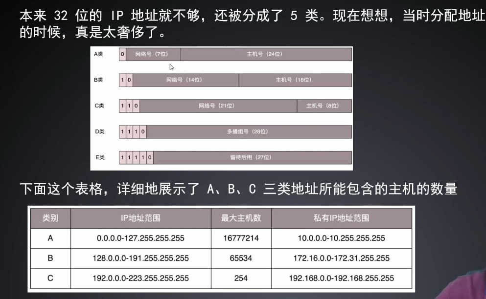

# 2021.8.20-通讯

## （一）通讯名词

### 1、信道、通讯接口、通讯规约

两台或多台设备之间要通信，必须有硬件和软件的支持。硬件包括信道及通信接口，软件就是各种规约。

- 信道

  也叫通讯介质，通常有：有线信道、载波信道、微波信道、光纤信道等。

- 通讯接口

  - 定义：一种通讯的标准，只有两台设备都采用这个标准，才有可能通信。但如果通讯规约不同，双方接收和发送的软件不配套，也不能通讯。
  - 分类：RS-232串口、RS-485串口、CANbus现场总线接口、以太网接口等。接口相同是通讯的基础，在此基础上再谈规约是否相同。比如，同样是RS485接口，电度表用的是DL645规约，而继保装置用的是保护规约，两者不能通讯。

- 通讯规约（协议）

  protocol，是一回事。电力行业叫规约，计算机行业叫协议。

  - 定义：是指通信双方必须共同遵守的约定，也称为通信控制规程或传输控制规程。
  - 内容：
    - 信息传送格式：收发方式、传送速率、帧结构、帧同步字、位同步方式、干扰措施等。
    - 信息传送的具体步骤：将信息分类、分循环周期传送、系统对时数据收集方式和设备状态监视方式。

- 通讯接口和规约的关系

  

  

### 2、遥测、遥信、遥控、遥调

- 遥测

  远程测量。被动获得远程信号，测量其数值采集并传送运行参数，包括电流、电压、功率、频率、温度、压力、流量等模拟量信号。将被监视厂站的主要参数变量远距离传送给调度。（运行参数）

- 遥信

  远程信号。采集并传送各种保护和开关量信息，就是远方状态信号，包括开关位置信号、保护信号等。采用无源节点方式，即一路遥信的输入应是一对继电器的触点，或者是闭合，或者是断开。（运行状态）

- 遥控

  远程控制。就是远方控制操作，是从调度或监控中心发出命令以实现远方操作和切换。主动发出信号，控制远端操作，包括分合闸、断路器的分和操作、开关控制设备的远程控制等。采用无源节点方式。

- 遥调

  远程调节。接收并执行遥调命令，对远程的控制量设备进行远程调试，如调试发电机输出功率、有载调压变压器抽头的升降调节、其他可采用一组继电器控制具有分级升降功能的场合。采用无源节点方式。

## （二）网络通信

### 架构

- C/S架构

  C：client，客户端；S：sever，服务端。

  - 硬件C/S架构：打印机
  - 软件C/S架构：APP等

- B/S架构

  B：browser，浏览器；

  很多网站是基于浏览器进行访问的，浏览器和各个网站服务端进行的通讯方式常被称为B/S架构。

### 设备与概念

ip地址是门牌号（收货地址），mac地址是身份证。

#### 网卡、mac地址

- 网卡：是网络硬件，提供了网络的接口，ethernet规定接入internet的设备都必须具备网卡。

  网卡两端的通信方式：网卡上面装有处理器和存储器（包括RAM和ROM）。网卡和局域网之间的通信是通过电缆或双绞线以串行传输方式进行的。而网卡和计算机之间的通信则是通过计算机主板上的I/O总线以并行传输方式进行。

  网卡功能：网卡的一个重要功能是进行串行/并行转换。另外，由于网络上的数据率和计算机总线上的数据率并不相同，因此在网卡中必须装有对数据进行缓存的存储芯片。

- mac地址：网卡发送端和接收端的地址即网卡地址（身份证）

  定义：Media Access Control，媒体访问控制，可理解为信号在通信线路介质传送中一种最基本的管理和控制能力。

  格式：6C-2B-59-77-1B-D1，由12位16进制数表示（前6位是厂商编号，后六位是流水线号）。

  每两位数字范围为0-255共256，总共可表示256^6个mac地址，即2^48个，281万亿个地址。

#### IP地址、域名

##### IP地址

- IP地址：（名字），IP地址+子网掩码

  - 作用：一是为每一台计算机分配IP地址，二是确定哪些地址在同一个子网络。

  - 分类：IPV4和IPV6。

  - 组成：比如IP地址为211.99.34.33，子网掩码为255.255.255.248。

    - IP地址：单纯的IP地址只是标识了ip地址的种类，从网络部分或主机部分都无法辨识一个ip所处的子网。

      - 网络部分：标识子网，211.99.34为子网部分、
      - 主机部分：标识主机，33为主机部分

    - 子网掩码：表示子网络特征的参数。知道子网掩码，就能判断该ip地址所处的子网络。

      - 子网络网段：

        子网地址：ip地址和子网掩码and运算得到子网地址，211.99.34.33 & 255.255.255.248 = 211.99.34.32，即为子网地址。

        子网段ip地址数量：（256-255）*（256-255） * （256-255） * （256-248）=8，8表示此网段包含有8个ip地址。

        广播地址：该网段最后一个ip地址称为广播地址，即211.99.34.39。

    只有ip地址+子网掩码，才能确定该ip所处的子网网段；才能确定两个ip地址是否处于同一网段。

  - ipv4格式：192.168.0.0（十进制表示方法），0.0.0.0 - 255.255.255.255，转化为二进制的即为：00000000.00000000.00000000.00000000 - 11111111.11111111.11111111.11111111，也就是由4个8位的二进制数表示。

  - Ipv4个数：256^4个IP地址，即2^32个，42.94亿个地址。

- 域名，domain name：即IP地址转化为好记的域名。

- IP操作的几个命令

  - 查看IP地址：linux：ifconfig。windows：ipconfig。
  - ping：
  - ip addr：显示了这台机器上所有的网卡。大部分的网卡都会有一个IP地址。IP地址是一个网卡在网络世界的通讯地址，相当于现实世界的门牌号码。一个要求就是不能一样，以免出现IP地址冲突。

- IPv4地址分类：

  五类：类别号+网络号+主机号

  其中全0是网络号，最后一位是255的是广播地址（全网段都能接收到）。

  - A类：0开头：

  

##### CIDR：无类型域间选路

- 格式：网络号+主机号，16.158.165.91/22，其中22表示前22位为网络号，后10位为主机号，因此求该IP地址的网络号、子网掩码和广播地址，可如此：

  - 后10位为主机号，因此165的后两位为主机号，165的二进制位：1010 0101，因此后两位置为0，及165-1=164，即16.158.164.0即为网络号（该网段第一个IP地址）。

  - 子网掩码，第三个点分十进制的255的后两位置为0，即255-3=252，即子网掩码为255.255.252.0。

  - 广播地址即主机号位全部置为1，及165的后两位置为1，变为167，所以广播地址为16.158.167.255。

    注意：此类题目的解法。

- 广播地址

- 网络号

- 子网掩码：子网掩码 & 主机号 = 网络号

##### 内网和外网（公有IP和私有IP）

两者真正的区分：通过IP地址分别。

- 内网：又称局域网，局域网IP地址只限于在本局域网内用，在本局域网内唯一。但是在另外一个局域网内，这个IP地址仍然能够使用。

  局域网三个关键技术：网络拓扑、传输介质和介质访问控制方法。

  - 按网络拓扑结构分类：
    - 总线型
    - 星型
    - 环型
    - 树型
    - 混合型
  - 按网络使用的传输介质分类：
    - 有线网：同轴电缆、双绞线
    - 无线网：蓝牙、红外
  - 按传输介质访问控制方法分类：
    - 以太网：以太网是当前应用最普遍的局域网技术。在3Mb/s-1Gb/s之间都是适合的。
    - 令牌环网
    - FDDI网
    - 无线局域网

- 外网：又称广域网，广域网所有的IP地址都是唯一的。比如山西电信的NDS服务器IP地址是61.134.1.4，这个地址在全世界是唯一的。

  仅有内网地址是不可以上网的，还需要一个外网地址，即公网地址（全世界唯一），公网地址在对外出口的路由器上，也即你的外网网关地址。

  重点：内网IP和公网IP。

#### 广播

世界大网络是由一个个小的彼此隔离的局域网组成，以太网包只能在一个局域网内发送，一个局域网是一个广播域。

以太网帧的数据格式：head （包括发送者MAC地址、接收者MAC地址、数据类型） + data。一个主机发送消息，统一局域网广播域内所有主机均会收到该数据包，目标主机通过MAC地址识别接收该数据包，其余非目标主机弃包。

#### DHCP协议

#### IP层和ARP协议

#### ping命令和ICMP协议

#### 网络报文封装过程

#### 网桥

- 网桥hub：局域网内主机互联。

  特点：

  - 广播的方式发送数据包。
- 脏包量大：假设局域网内有n台主机，则由A向B发送数据包时，将产生（n-2）个脏包，发送m次数据将产生m（n-2）个脏包，将造成信道占用、脏包过多处理等，造成效率过低。

#### 交换机

- 交换机：更聪明的局域网内互联设备，能够记录与交换机某个端口相连的主机的mac地址，从而避免太多脏包的广播发送。

  对于连接路由器的交换机，主要作用是搭桥用，即让连接该交换机的所有电脑都能连接起来，只要是同一个网段的都可以进行通信。

#### 路由器、网关

##### 路由器

作用：如果在同一网段，直接将源地址和目标地址放入IP头中，通过ARP协议获得MAC地址，将源MAC和目的MAC放入MAC头中，发出去就可以了；如果不在同一网段，网关与源地址属于同一网段（一般网关是网段的第一个或第二个IP），就需要先通过ARP获得网关的MAC地址，将源MAC地址和网关MAC放入MAC头中，发送出去。

网关往往是一个路由器，是一个三层转发的设备。

三层设备：就是把MAC头和IP头都取下来，然后根据里面的内容，看看接下来把包往哪里转发的设备。

很多情况下，人们把网关叫做路由器，其实不完全准确。

正确关系：路由器是一台设备，有多个网口或者网卡，分别连接着多个局域网。每个网卡的IP地址都和其所连局域网的IP地址处于同一个网段，每个网卡都是它握住的那个局域网的网关。任何一个想发往其他局域网的包，都会到达其中一个网关，被拿进来，拿下MAC头和IP头，看看，根据自己的路由算法，选择另一个网口，加上IP头和MAC头，然后扔出去。

- 作用

- 网关：Gateway，是网络的进口和出口，实质是一个网络通向其他网络的IP地址。是逻辑概念。

  - 路由器将多个局域网相连，每个局域网的出口就叫网关。
  - 一个路由器至少有两个网卡，一个网卡连接光猫/外网，一个网卡连接内网，两个网卡的ip地址不在同一个网段内，比如外网为192.168.0.1，内网为192.168.1.1，如此方能联网。而此两个网卡的ip地址即为网关。

  协议翻译作用，是一个结点（概念层），TCP/IP协议里的网关最常用。只有设置好网关的IP地址，TCP/IP协议才能实现不同网络之间的相互通信。

  网关的IP地址是具有路由功能的设备的IP地址，包括路由器、启动了路由协议的服务器、代理服务器。

- 路由器：Router，把数据从一个地方传送到另一个地方设备，使用一系列算法决定网络间的最短路径。是物理设备。

- 

##### 路由表

路由表：Routing Table，为完成路由功能，在路由器中保存着各种传输路径的相关数据，即路由表。表中保存着子网的标志信息、网上路由器的个数和下一个路由器的名字等内容。

- 静态路由表：static，系统安装时根据网络配置情况预先设定。
- 动态路由表：dynamic，根据路由选择协议提供的功能，自动学习和记忆网络运行状况，在需要时自动计算数据传输的最佳路径。

从定义看，如果只是简单的连接两个网络，只需要网关即可。如果是连接多个网络，则需要路由功能来计算网络最短路径。

多数情况下路由器集成了网关的功能。

- 接口
  - wan口：外网接口，所有给内网的设备外发请求都通过路由的外网接口发送出去。
  - lan口：每个lan口的IP地址可以是静态的，也可以是动态（DHCP协议，动态主机分配协议，Dynamic Host Configuration Protocol），比如某个网段的设备，都通过这个lan口传输信息。

- 静态路由

  - 命令

    windows：route print

    linux：route，netstat -rn

    当局域网内一台主机发包时，先去静态路由表中查找网络目标IP，若没有，则默认发到IP为0.0.0.0，网关为局域网网关IP地址上，有网关转发。

- 转发网关

  由一个局域网跳到下一个局域网，在局域网内转发包。

  - 在不同局域网见转发，每到一个新局域网，源MAC变为该网关口的网卡MAC，目标MAC变为同局域网内下一步发送地址的网卡MAC，源IP和目标IP不变，始终为发送主机和目标主机的IP。
  - 在同一个局域网内，通过同IP段的IP地址，通过ARP协议获取下一节点的MAC地址。

- NAT网关

  - NAT网关转发数据包过程
  - windows抓包：wireshark。
  - linux抓包：sudo  tcpdump  icmp。

- 动态路由算法

  - 距离矢量路由，distance vector routing：好消息传得快，坏消息传的慢；网络规模大时效率低，超过15跳时不适用。
  - 链路状态路由，link state routing：dijkstra算法（图的最短路径），

### 流程（硬件）

- client端：

  - 打开浏览器，开启一个进程，由本机操作系统分配一个端口号。
  - 在浏览器输入网址（域名），由此端口号发送服务请求。

- 交换机、路由器（客户端）：接收client信息，路由发给DNS服务器。

- DNS服务器：通过域名协议查找IP地址。

  - 本地DNS服务器：查询是否有该网址的缓存记录（即是否有该网址对应的IP地址），若无，发送给根服务器。

  - 13台根服务器：根据网址后部内容，.com属于com区域服务器管理，传回顶级域名服务器地址。

  - 13台顶级域名服务器：163.com主区域的服务器知道该网址IP地址，传回163.com域服务器地址。

  - .com域服务器：查询得到IP地址为1.1.1.1，传回该IP地址给本地DNS服务器。

    本地DNS服务器保存该地址，并下传给网络客户端。

- 路由器（客户端）：通过路由协议找到一个路由转发的最优路径，将网络客户端的服务请求发送给这个IP地址的路由器。

- 路由器（服务端）：将请求发给服务端。

- 服务器：根据请求，将相关信息沿原路径转发回客户端。

- client端（浏览器）：网卡接收到服务端发来的消息后，由操作系统通过端口号找到该浏览器，将信息展示在浏览器上。

### 流程（协议）

#### OSI七层协议

#### TCP/IP五层模型

##### （0）综述

可以以网络层为分界点，网络层只有IP协议。

网络层以下是物理层和数据链路层，只负责实现路由和转发。

网络层以上是传输层，可以解决连接错误、数据错误带来的可靠性问题等。传输层处理的还是数据包。

基于传输层实现的是应用层。应用层的目的是根据不同的服务需求提供具体的服务。应用层将数据看作是一段连续的字节，因此传输层需要将数据包合为一段连续的数据，提供给应用层。

传输层和应用层负责向需要数据的应用提供服务。操作系统的作用之一也是为用户程序提供服务。

##### （1）物理层

- 定义：

- 内容：基于电器特性发送高低电压（电信号），高电压对应1，低电压对应0。

- 作用：

##### （2）数据链路层

关键词：局域网；MAC地址；广播；以太网协议；通信基本靠吼（广播）；

- 定义：定义了电信号的分组方式，使单纯的0和1电信号组合为确定的意义。
- 作用：在局域网内，通过MAC地址识别和广播的方式，使局域网内数台主机通讯的方式。
- 内容：
- 协议：以太网协议。早期的令牌环等协议逐渐消亡，形成了统一的以太网协议。
  - 格式：目标MAC地址 + 发送源MAC地址 + TPID + TCI + 数据类型 + data + CRC（校验）。

##### （3）网络层

关键词：不同广播域通信；路由；IP协议；IP地址+子网掩码；ARP协议（获取不同网段目标主机mac地址）；

- 定义：不同广播域（局域网）之间通信。

- 作用：局域网内可通过以太网协议、以广播的方式通讯，但在多个局域网构成的大网络中，以广播的方式通讯不可行。引入一套新的地址用来区分不同的广播域/子网，这套地址即网络地址。

- 内容：

- 主要协议一：IP协议，Internet Protocol Address，互联网协议地址。

  - 定义：规定网络地址的协议叫IP协议，它定义的地址称为IP地址。
  - 组成及作用：IP地址+子网掩码，一是为每一台计算机分配IP地址，二是确定哪些地址在同一个子网络。
  - IP数据包：
    - 格式：head + data，head长度20-60字节，data最长为65515字节。因以太网数据包的data部分最长只有1500字节，因此如果ip数据包超过1500字节，就需要分割成几个以太网数据包分开发送。
    - 无须为ip包定义单独的栏位，直接放入以太网的data部分。
    - 以太网头 + IP头 + IP数据

- 主要协议二：ARP协议：Address Resolution Protocol，地址解析协议。

  - 定义：是根据IP地址获取物理地址的一个TCP/IP协议。

  - 过程：主机发送信息时将包含目标IP地址的ARP请求广播到网络上的所有主机，并接收返回消息，以此确定目标的物理地址。收到返回消息后，将该IP地址和物理地址存入本机ARP缓存中并保留一定时间，下次请求时直接查询ARP缓存以节约资源。

    例如主机172.16.10.10/24访问172.16.10.11/24：

    - 首先通过ip地址和子网掩码区分两者是否处于同一子网。

      同一子网：数据包地址为：目标主机mac，目标主机ip

      不同子网：数据包地址为：网关mac，目标主机ip

    - 不同子网，则由目标ip，通过ARP协议获取目标网关mac

    - 由该网关向该子网内发送数据包，所有主机接收后拆开包，发现目标ip为自己的，就响应，返回自己的mac地址。

##### （4）传输层

关键词：端到端通信；TCP协议；UDP协议；socket套接字；三次握手和四次挥手；

- 定义：找到与之建立通讯的主机的具体程序，体现为端口（port）。

- 作用：建立端口到端口的通信。

- 内容：端口范围0-65535（2^16）。0-1023为系统占用端口，

- header内容

  - 校验和（checksum）：可以被用来检查数据在传输过程中是否产生了错误。通过将数据包的数据输入一个函数，检查函数的输出值与数据包标头中包含的校验和是否相同来验证是否出现了错误。

- TCP协议（Transmission Control Protocol）传输控制协议，

  - 定义：提供面向连接、可靠的字节流服务。当客户端和服务端彼此交换数据前，必须先在双方之间建立一个TCP连接，之后才能传输数据。TCP提供超时重发、丢弃重复数据、检验数据、流量控制等功能，保证数据能从一端传到另一端。（面向连接，传输数据前先建立可靠连接，数据控制，类似打电话的过程）。

  - TCP数据包内容：没有长度限制，理论上可以无限长，但为了保证网络效率，通常不会超过IP数据包的长度，以确保单个TCP数据包不必再被分割。

    格式：以太网头+ip头+tcp头+数据。

  - 报文首部/标头

    - 发送端口、接收端口、校验和与UDP相同
    - 序列号：TCP发送数据时将数据拆分为多个数据包，序列号标注了每个数据包属于哪个数据流、在数据流的什么位置。SYN + SYNACK + ACK，三次握手。
    - 

    

  - 三次握手：TCP建立端到端连接，三次发送报文（请求连接报文、同意连接报文、确认报文）

    前提：TCP服务器进程提前已创建传输控制块TCB，时刻准备接收客户进程的连接请求，此时服务器处于LISTEN（监听）状态。

    

    - 注意1：三次握手的简易理解：

      A：你好，我是A。

      B：你好A，我是B。

      A：你好B。

    - 注意2：TCP包的顺序问题和丢包问题：

      每个连接都有不同的序号，这个序号的起始序号是随着时间变化的，可以看成一个32位的计数器，每4微秒加1，计算下来，如果到重复，需要4个多小时。IP包头里有个TTL，即生存时间，超过这4个小时的包早就死翘翘了。

      顺序性：为了保证顺序性，每一个包都有一个ID。在建立连接时，会商定起始的ID是什么，然后按照ID一个个发送。为了保证不丢包，对于发送的包都要进行应答，应答方式不是一个一个来的，而是会应答某个之前的ID，表示之前的都收到了，这种模式称为累计确认或累计应答。

      几种状态：

      - 发送端：发送已确认：表示已发送，并且也已经收到接收端ack
      - 发送端：发送未确认：表示已发送，但未收到接收端ack
      - 发送端：未发送可发送：表示还未发送，并且接收端也有足够缓存可接收
      - 发送端：未发送不可发送：表示还未发送，并且接收端无足够缓存接收
      - 接收端：接收已确认：已接收到包，并且已发送ack
      - 接收端：等待接收未确认：某个包丢失，或者后包先到。此时发送的ack还是之前累计的ID
      - 接收端：不能接收：表示缓存已满，无法接收

      超时重发：对于发送端，已发送到没收到ACK的包，都有设一个定时器，超过一定时间，就重新尝试再发。这个时间不宜过短，必须大于往返时间RTT，否则会引起不必要的重传。

      自适应重传算法（Adaptive Retransmission Algorithm）：估计往返时间，需要TCP通过采样RTT的时间，然后进行加权平均，算出一个值（由于网络状况不断变化，因此这个值也不断变化）。除了采样RTT，还要采样RTT的波动范围，计算出一个估计的超时时间，此称为自适应重传算法。

      快速重传机制：比如当接收方收到ID为6的包后，会发一个7的ACK。如果7包一直未收到，但是连续收到了8包和9包，此时由于累计确认机制，会在收到8包和9包时，两次发送7的ACK。当接收端收到3个冗余的ACK时，可以基本确认是7包丢了，这时就会不等超时，马上重发7。称为快速重传机制。

      Selective Acknowledgement（SACK）选择确认机制：需要在TCP包中建立一个SACK的东西，可以将缓存的地图发送给发送方，例如可以发送ACK6、ACK8和ACK9，有了缓存地图，发送方一下子就能看出来是7丢了。

    

    

    - 注意3：流量控制

      通过window的长度控制每次传输的包的数量。

    

    

    - 注意4：拥塞控制

      状态机

    

    - 第一次握手：（客户进程发送连接请求报文）TCP客户进程先创建传输控制快TCB，然后向服务器发出连接请求报文。报文首部中的同步位SYN=1，同时选择一个初始序列号seq=x。此时TCP客户端进程进入SYN-SENT（同步已发送）状态。（SYN=1的报文段不能携带数据，但需要消耗掉一个序号）。

      SYN=1，seq=x（随机产生初始序列号）

    - 第二次握手：（服务器发送同意连接的确认报文）TCP服务器收到请求连接报文后，如果同意连接，则发出同意连接的确认报文。确认报文中确认字段ACK=1，同步位SYN=1，确认号是ack=x+1，同时也要为自己初始化一个序列号seq=y。此时TCP服务器进入SYN-RCVD（同步收到）状态。（这个报文也不能携带数据，但同样要消耗一个序号）。

      SYN=1，seq=y，ACK=1，ack=x+1

    - 第三次握手：（客户进程发送收到确认报文）TCP客户进程收到同意连接的确认报文后，还要向服务器给出确认。确认报文的确认码ACK=1，ack=y+1，自己的序列号seq=x+1。此时TCP连接建立，客户端进入ESTABLISHED（已建立连接）状态。（ACK报文段可以携带数据，但是如果不携带数据则不消耗序号）。

      ACK=1，ack=y+1，seq=x+1

    当服务器收到客户端的确认后也进入ESTABLISHED状态，此后双方可以通信。

    注意：为什么TCP客户端最后还有发送一次确认？主要防止已经失效的连接请求报文突然又传送到了服务器，产生错误。

  - 数据传输

    基于窗口的发送方法，累计确认，计时器

    - 窗口法：以数据包数量来衡量大小固定的区间。假设窗口大小为w，TCP在发送数据包时，一次只允许w个数据包处于传输过程中。

    - 累计确认（cumulative ACK）：如果接收方已经收到某个数据包，就会回复一个ACK数据包。但是这个ACK承认的并不是这个数据包本身，而是所有到目前为止接收到的数据包中由起始数据包开始、序号连续的数据包的最后一个序号加1。比如接收到1,2,4,3这个序列，在数据包2到达时，ACK会回复3；在数据包4到达时，由于不连续，ACK还是回复3；在数据包3到达时，ACK才会回复5。因此被称为累计确认。

      注意：数据包实际不是被编号的。它们的序列号等于起始序列号与这个数据包再数据中的偏移字节数之和。比如若每个数据包包含了1400字节，那第二个数据包的序列号=第一个数据包的序列号+1400。

    - 计时器：TCP传输时，系统会设定一个计时器，在每次有新的数据包被承认时会被重置。如果计时器超时，那么最新的ACK序列号代表的数据包就会被重新发送，超时时限会变为原来的2倍，窗口的大小也会随之减小为原来的一半。随着每个数据包被承认，窗口都会向前移动。在成功传输一个窗口的内容后，窗口大小会加1，这样就可以充分利用带宽的同时保证不使网络过载。

      网络好，窗口大小增加；网络不好，窗口大小减小。

  - 四次挥手：数据传输完毕后，双方释放连接。

    FIN，ACK，FIN，ACK四次挥手

    数据传输完毕时，双方都处于ESTABLISHED状态。

    - 第一次挥手：（客户进程发送连接释放报文，并停止发送数据）。释放连接报文首部，FIN=1，序列号seq=u（等于前面已经传送过来的数据的最后一个字节的序号加1）。此时客户端进入FIN-WAIT-1（终止等待1）状态。（FIN报文段即使不携带数据，也要消耗一个序号）。

    - 第二次挥手：（服务器发送释放连接请求的确认报文）确认报文，ACK=1，ack=u+1，序列号seq=v。此时服务端就进入CLOSE-WAIT（关闭等待）状态。TCP服务器通知高层的应用进程，客户端向服务器的方向就释放了，这时候处于半关闭状态，即客户端已经没有数据要发送了，但若服务器发送数据，客户端依然要接受。这个状态要持续一段时间，即整个CLOSE-WAIT状态持续时间。

      客户端收到服务器的确认请求后，客户端就进入FIN-WAIT-2（终止等待2）状态，等待服务器发送连接释放报文。（在此之前还需要接受服务器发送的最后的数据）。

    - 第三次挥手：（服务器发送连接释放报文）当服务器将最后的数据发送完毕后，就向客户端发送连接释放报文，FIN=1，ack=u+1，由于在半关闭状态，服务器可能又发送了一些数据，假定此时序列号是seq=w。此时服务器进入LAST-ACK（最后确认）状态，等待客户端确认。

    - 第四次挥手：（客户端发送连接释放确认报文）客户端收到服务器的连接释放报文后，必须发出确认报文。ACK=1，ack=w+1，序列号是seq=u+1。此时，客户端就进入TIME-WAIT（时间等待）状态。

      客户端：注意，此时的TCP连接还没有释放，必须经过2 * MSL（最长报文段寿命）的时间后，当客户端撤销响应的TVB后，才进入CLOSED状态。

      服务端：服务器只要收到客户端的确认，立即进入CLOSED状态。同样，撤销TVB后，就结束了这次TCP连接。（可以看到，服务器结束TCP连接的时间要比客户端早一些）。

    Q：为什么客户端最后还要等待2 * MSL？MSL（Maximum Segment Lifetime）：

    零、报文最大生存时间，是任何报文在网络上存在的最长时间，超过这个时间报文将被丢弃。因为TCP报文是基于IP协议的，而IP头中有一个TTL域，是IP数据报可以经过的最大路由数，每经过一个处理他的路由器此值就会减1，当此值为0时数据报将被丢弃，同时发送ICMP报文通知源主机，协议规定MSL为2分钟，实际应用中常用的是30s、1min和2min等。

    一、保证客户端发送的最后一个ACK报文能到达服务器。若该ACK报文丢失，则从服务器角度看，服务端已发送了FIN+ACK报文请求断开，客户端没回应，所以会重新发送一次FIN+ACK，此时客户端可在2 * MSL时间内收到这个重传的报文，接着给出回应报文，并重启2MSL计时器。

    二、防止类似与“三次握手”中提到的已经失效的连接请求报文段出现在本连接中。客户端发送完最后一个确认报文后，在2MSL时间中，就可以使本连接持续的时间内所产生的的所有报文从网络中消失，这样新的连接中不会出现旧连接的请求报文。
    
    Q：为什么建立连接是三次，关闭连接是四次？
    
    建立连接时，服务器已经处于LISTEN状态，收到建立连接请求的SYN报文后，把ACK和SYN放在一个报文里发送给客户端。而在关闭连接时，服务器收到对方的FIN报文时，仅仅表示对方不再发送数据了，但是对方还能接收数据，而自己也未必已将全部数据发送给对方了，所以己方可以立即关闭，也可以继续发送一些数据给对方后，再发送FIN报文给对方来表示同意现在关闭连接。因此己方的ACK和FIN一般都会分开发送。

- UDP协议（User Datagram Protocol）用户数据报协议，

  - 定义：简单的面向数据报的协议，不提供可靠性。在传输数据前不用在客户端和服务端建立一个连接，且没有超时重发等机制，因此传输不可靠、传输速度快。（面向无连接，传输数据时不建立连接，不控制数据，类似写信寄信的过程）。

  - UDP数据包内容：报头部分一共只有8个字节，总长度不超过65535字节，正好放进一个IP数据包。

    格式：以太网头+ip头+udp头+数据。

- 套接字：

  - 定义：本地进程间通讯可以使用PID来唯一标示一个进程。网络中两个进程通讯就需要：IP地址+TCP协议+端口号来唯一标示网络中的一个进程。
  - 参数：socket两端的IP地址、端口号，socket使用的传输层协议。
  - （socket），每一条TCP连接都有两个端点，称为套接字，定义和格式为：IP地址:端口号，如192.3.4.16:80。
  - socket是在传输层和应用层之间的一个抽象层，它把TCP/IP层复杂的操作抽象为几个简单的接口，以供应用层调用以实现进程在网络中的通信。

##### （5）应用层

关键词：规定应用程序的数据格式；

- 定义：TCP协议可以为各种各样的程序传递数据，比如Email、WWW、FTP等，那么，针对不同的程序，要有不同的协议规定各程序的数据格式，这些应用程序协议就构成了应用层。

#### 流程

访问www.google.com的过程：

- 本机信息获取：

  - 本机ip地址
  - 子网掩码
  - 网关的ip地址
  - DNS的ip地址

- 打开浏览器，在地址栏输入网址（域名）

- DNS协议：将域名转化为ip地址

- http部分的内容：http数据包会被嵌在TCP数据包之中。

- TCP协议：TCP数据包需要设置端口，接收方（google）的http端口默认是80，发送方（本机）的端口是一个随机生成的1024-65535之间的整数，假定为51775。

  TCP数据包加上http数据包。

- IP协议：TCP数据包再嵌入IP数据包。IP数据包需要设置双方的IP地址。

- 以太网协议：IP数据包嵌入以太网数据包。以太网数据包需要设置双方的MAC地址，发送方为本机的网卡MAC地址，接收方为网关192.168.1.1的MAC地址（通过ARP协议得到）。

- 服务器响应：经过多个网关转发，google的服务器收到这几个以太网数据包。根据IP标头的序号，服务器将几个以太网包拼起来，取出完整的TCP数据包，读出里面的http请求，接着做出http响应，再用TCP协议发回来。

- 本机收到http响应以后，就可以将网页显示出来，完成一次网络通信。

Q：适配器（Adapter）和控制器（Controller）区别：

两者功能都是在I/O总线和I/O设备之间传递信息。

控制器是置于I/O设备本身的或者系统的主印制电路板（主板）上的芯片组，而适配器则是一块插在主板插槽上的卡。

- 信息：位+上下文（转换规则）

  二值信号表示：

  - 数字编码：

    - 无符号编码：非负数

    - 二进制补码：有符号数

    - 浮点数编码：浮点数/实数

  - 字符编码：ASCII码

- 

